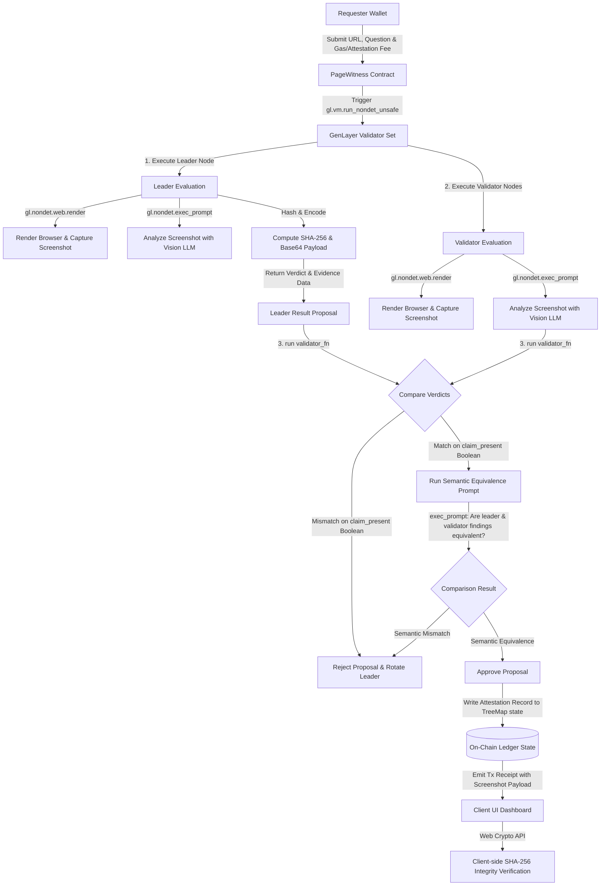

# PageWitness: On-Chain Semantic Web Verification Protocol

PageWitness is a decentralized web audit protocol running on **GenLayer**. It creates immutable, timestamped, on-chain attestations of what a public webpage displayed at a given point in time. 

By utilizing browser rendering, vision-capable Large Language Models (LLMs), and decentralized consensus, PageWitness enables trustless verification of website promises, tokenomics allocations, roadmap milestones, and APY claims, resolving disputes without relying on client-side screenshots or centralized screenshotting providers.

---

## Architectural Breakthroughs (vs. Legacy Attestation Designs)

1. **Semantic Rationale Equivalence (Anti-Fragile Consensus):** 
   Legacy attestation contracts fail consensus when different validators under greyboxing produce slightly different wording for the extracted webpage text. PageWitness resolves this by enforcing a strict match only on the core boolean verdict (`claim_present`), while using a comparative LLM prompt in the validator function to verify that the leader's and validator's rationales are semantically equivalent.
2. **Deterministic Rendering Shift Protection:** 
   Webpages contain dynamic contents (clocks, ads, load spinners) and render slightly differently across nodes due to OS font antialiasing. Requiring byte-for-byte matches on screenshot hashes causes constant consensus breakdown. PageWitness validators verify the screenshot's integrity by checking if the leader's screenshot is valid, while relying on the semantic LLM comparison of page contents rather than strict pixel-level hashes.
3. **On-Chain Gas Optimization:** 
   Storing massive base64 screenshot strings in contract state causes severe state bloat and high transaction fees. PageWitness introduces a `store_screenshot` flag. When disabled, the full base64 screenshot data is returned in the transaction receipt (remains auditable and readable by the frontend) but is omitted from persistent contract storage. The SHA-256 integrity hash is always stored on-chain to guarantee proof validity.

---

## Consensus Adjudication Flow



---

## Codebase Map

- [pagewitness.py](file:///Users/okoyes/Desktop/ODbeke/Gen%20Portal%202/pagewitness/contracts/pagewitness.py) — The Intelligent Contract containing page rendering, vision processing, custom error handler classifications, and semantic validation.
- [test_pagewitness.py](file:///Users/okoyes/Desktop/ODbeke/Gen%20Portal%202/pagewitness/tests/direct/test_pagewitness.py) — 15 unit tests covering contract state modifications, strict boolean parsing, and validator agreement.
- [conftest.py](file:///Users/okoyes/Desktop/ODbeke/Gen%20Portal%202/pagewitness/tests/direct/conftest.py) — Intercepts PIL image imports to enable mock-based unit tests.
- [deploy.mjs](file:///Users/okoyes/Desktop/ODbeke/Gen%20Portal%202/pagewitness/scripts/deploy.mjs) — Script to compile and deploy PageWitness to Testnet Bradbury using `genlayer-js`.
- [frontend/](file:///Users/okoyes/Desktop/ODbeke/Gen%20Portal%202/pagewitness/frontend/) — React + TypeScript dashboard with a glassmorphic dark theme, sequential RPC polling, and a client-side Web Crypto integrity verification panel.

---

## Quick Start Guide

### Contract & Deployment Setup

1. Install dependencies in the project root:
   ```bash
   npm install
   ```
2. Copy `.env.example` to `.env` and enter your GenLayer funded address credentials:
   ```bash
   cp .env.example .env
   ```
3. Deploy to Testnet Bradbury:
   ```bash
   npm run deploy
   ```
   *Note the printed contract address.*

### Running the Tests

Execute the direct-mode unit test suite:
```bash
python3 -m pytest tests/direct/ -v
```

### Frontend Dashboard Installation

1. Navigate to the frontend directory:
   ```bash
   cd frontend
   ```
2. Install frontend assets:
   ```bash
   npm install
   ```
3. Copy `.env.example` to `.env` and fill in the deployed contract address:
   ```bash
   cp .env.example .env
   # Set VITE_CONTRACT_ADDRESS to your deployed address
   # Set VITE_PRIVY_APP_ID from your Privy Dashboard (optional for write functions)
   ```
4. Run the development server locally:
   ```bash
   npm run dev
   ```
5. Build the production application bundle:
   ```bash
   npm run build
   ```

---

## UI/UX Highlights

- **Custom Premium Typography:** Uses *Outfit* for modern headlines and *Space Grotesk* for clean interface alignments.
- **Micro-Animations:** Interactive elements and table rows are smoothly animated using *Framer Motion*.
- **Client-Side Verification Confetti:** Decoding and hashing the base64 screenshot on the client's browser rewards successful integrity checks with a confetti micro-interaction.
- **Optimized Network Polling:** Queries the RPC sequential-by-row to stay under GenLayer RPC rate-limiting parameters.
